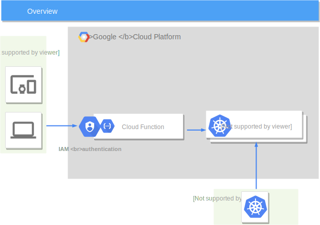

# Kubernetes backed configuration store

## Overview
Uses GKE masters as a place to store your configuration in configmaps.
This is a low cost option, as Google Cloud Platform does not charge for the Kubernetes masters, and the API server and underlying etcd cluster runs on the masters.

A Cloud function is deployed as a way to fetch the configuration from anywhere using a JSON API. Cloud Function authentication is provided through IAM policies.

kubectl can be used normally to configure configmaps. 

## Deployment

Use the automated deployment by following the tutorial:  

## Auhenticating

The GKE cluster can be accesses with kubectl or similar normally.

The Cloud function is protected by IAM. See https://cloud.google.com/functions/docs/securing/authenticating
